# 🎯 Objetivo del Análisis
Este ejercicio tiene como objetivo identificar las dimensiones subyacentes (factores latentes) que explican las percepciones de cohesión territorial en Chile, utilizando 8 variables del módulo de cohesión barrial de la encuesta ELSOC.

### Pregunta de investigación: ¿Las percepciones de cohesión barrial se organizan en una o múltiples dimensiones subyacentes?

**Hipótesis teórica:** Se espera encontrar dos dimensiones:

- Dimensión 1: Pertenencia/Identidad (vinculación afectiva con el barrio)

- Dimensión 2: Sociabilidad (relaciones con los vecinos)

# 📚 Fundamentos Teóricos
¿Qué es el Análisis Factorial Exploratorio (EFA)?

El Análisis Factorial Exploratorio es una técnica estadística multivariante que busca:

- Identificar la estructura subyacente de un conjunto de variables observadas

- Reducir la dimensionalidad agrupando variables correlacionadas en factores latentes

- Interpretar qué miden estos factores en términos teóricos

<div class="table-container" style="overflow-x: auto; margin: 30px 0;">

<table style="width: 100%; border-collapse: collapse; font-family: 'Segoe UI', sans-serif; font-size: 0.95em; box-shadow: 0 2px 8px rgba(0,0,0,0.1);">
<caption style="caption-side: top; text-align: center; padding: 12px; font-weight: bold; font-size: 1.1em; background-color: #f8f9fa; border: 1px solid #ddd; border-bottom: none;">
📋 Tabla 1: Variables utilizadas - Módulo de cohesión territorial (ELSOC)
</caption>
<thead>
<tr style="background-color: #2c2c2c; color: white;">
<th style="border: 1px solid #444; padding: 14px; text-align: center; font-weight: bold;">Variable</th>
<th style="border: 1px solid #444; padding: 14px; text-align: center; font-weight: bold;">Descripción</th>
<th style="border: 1px solid #444; padding: 14px; text-align: center; font-weight: bold;">Escala</th>
</tr>
</thead>
<tbody>
<tr style="background-color: #f9f9f9;">
<td style="border: 1px solid #ddd; padding: 14px; text-align: center; font-family: monospace; font-weight: bold;">barrio_ideal</td>
<td style="border: 1px solid #ddd; padding: 14px;">Este es el barrio ideal para mí</td>
<td style="border: 1px solid #ddd; padding: 14px; text-align: center;">
<span style="background-color: #e0e0e0; padding: 4px 8px; border-radius: 12px;">1-5</span>
</td>
</tr>
<tr style="background-color: #ffffff;">
<td style="border: 1px solid #ddd; padding: 14px; text-align: center; font-family: monospace; font-weight: bold;">integrado</td>
<td style="border: 1px solid #ddd; padding: 14px;">Me siento integrado/a en este barrio</td>
<td style="border: 1px solid #ddd; padding: 14px; text-align: center;">
<span style="background-color: #e0e0e0; padding: 4px 8px; border-radius: 12px;">1-5</span>
</td>
</tr>
<tr style="background-color: #f9f9f9;">
<td style="border: 1px solid #ddd; padding: 14px; text-align: center; font-family: monospace; font-weight: bold;">identifico</td>
<td style="border: 1px solid #ddd; padding: 14px;">Me identifico con la gente de este barrio</td>
<td style="border: 1px solid #ddd; padding: 14px; text-align: center;">
<span style="background-color: #e0e0e0; padding: 4px 8px; border-radius: 12px;">1-5</span>
</td>
</tr>
<tr style="background-color: #ffffff;">
<td style="border: 1px solid #ddd; padding: 14px; text-align: center; font-family: monospace; font-weight: bold;">parte_de_mi</td>
<td style="border: 1px solid #ddd; padding: 14px;">Este barrio es parte de mí</td>
<td style="border: 1px solid #ddd; padding: 14px; text-align: center;">
<span style="background-color: #e0e0e0; padding: 4px 8px; border-radius: 12px;">1-5</span>
</td>
</tr>
<tr style="background-color: #f9f9f9;">
<td style="border: 1px solid #ddd; padding: 14px; text-align: center; font-family: monospace; font-weight: bold;">amigos</td>
<td style="border: 1px solid #ddd; padding: 14px;">En este barrio es fácil hacer amigos</td>
<td style="border: 1px solid #ddd; padding: 14px; text-align: center;">
<span style="background-color: #e0e0e0; padding: 4px 8px; border-radius: 12px;">1-5</span>
</td>
</tr>
<tr style="background-color: #ffffff;">
<td style="border: 1px solid #ddd; padding: 14px; text-align: center; font-family: monospace; font-weight: bold;">sociable</td>
<td style="border: 1px solid #ddd; padding: 14px;">La gente en este barrio es sociable</td>
<td style="border: 1px solid #ddd; padding: 14px; text-align: center;">
<span style="background-color: #e0e0e0; padding: 4px 8px; border-radius: 12px;">1-5</span>
</td>
</tr>
<tr style="background-color: #f9f9f9;">
<td style="border: 1px solid #ddd; padding: 14px; text-align: center; font-family: monospace; font-weight: bold;">cordialidad</td>
<td style="border: 1px solid #ddd; padding: 14px;">La gente en este barrio es cordial</td>
<td style="border: 1px solid #ddd; padding: 14px; text-align: center;">
<span style="background-color: #e0e0e0; padding: 4px 8px; border-radius: 12px;">1-5</span>
</td>
</tr>
<tr style="background-color: #ffffff;">
<td style="border: 1px solid #ddd; padding: 14px; text-align: center; font-family: monospace; font-weight: bold;">colaboracion</td>
<td style="border: 1px solid #ddd; padding: 14px;">La gente en este barrio es colaboradora</td>
<td style="border: 1px solid #ddd; padding: 14px; text-align: center;">
<span style="background-color: #e0e0e0; padding: 4px 8px; border-radius: 12px;">1-5</span>
</td>
</tr>
</tbody>
<tfoot>
<tr style="background-color: #f0f0f0; font-size: 0.85em;">
<td colspan="3" style="border: 1px solid #ddd; padding: 12px; text-align: center; color: #555;">
<strong>Nota:</strong> Todas las variables son de escala ordinal tipo Likert (1=Totalmente en desacuerdo a 5=Totalmente de acuerdo). Estas variables provienen del módulo de cohesión territorial de la encuesta ELSOC (t02_01, t02_02, t02_03, t02_04, t03_01, t03_02, t03_03, t03_04).
</td>
</tr>
</tfoot>
</table>

<div style="text-align: center; padding: 8px; color: #666; font-size: 0.8em; border: 1px solid #ddd; border-top: none; background-color: #fafafa;">
<strong>Elaboración propia</strong> basada en datos del Estudio Longitudinal Social de Chile (ELSOC) - COES
</div>

</div>

# 📦 1. Instalación y Carga de Paquetes
¿Qué hacemos? Cargamos las librerías necesarias para el análisis factorial.

¿Por qué? psych es el paquete principal para EFA, sjPlot para tablas profesionales.

```{r, eval=FALSE}
# Cargar paquetes
library(dplyr)       # Manipulación de datos
library(psych)       # Análisis factorial (fa, KMO, scree)
library(knitr)       # Tablas en R Markdown
library(sjlabelled)  # Manejo de etiquetas
library(sjPlot)      # Tablas profesionales
library(ggrepel)     # Etiquetas en gráficos
library(ggbiplot)    # Biplots (opcional)

# Desactivar notación científica
options(scipen = 999)
```

# 📂 2. Carga de Datos
¿Qué hacemos? Importamos la base ELSOC desde el archivo .sav.

¿Por qué? Necesitamos los datos para realizar el análisis.

```{r, eval=FALSE}
# Cargar base ELSOC 
ELSOC_Long_2016_2023 <- haven::read_dta("C:/Users/caguilera/Dropbox/UAH/Cursos Sociologia/2 Sem 2025/Est IV/Laboratorios/Entrega 4/ELSOC_Long_2016_2023.dta")
```

# 🔍 3. Selección de Variables
¿Qué hacemos? Filtramos la ola 4 y seleccionamos las 8 variables de cohesión barrial.

¿Por qué? Nos interesa un corte transversal (2019) y las variables específicas del módulo.

```{r, eval=FALSE}
# Seleccionar variables de cohesión territorial (ola 4)
proc_data <- ELSOC_Long_2016_2023 %>%
  filter(ola == 4) %>%
  select(
    barrio_ideal = t02_01,   # Este es el barrio ideal para mí
    integrado = t02_02,       # Me siento integrado/a en este barrio
    identifico = t02_03,      # Me identifico con la gente de este barrio
    parte_de_mi = t02_04,     # Este barrio es parte de mí
    amigos = t03_01,          # En este barrio es fácil hacer amigos
    sociable = t03_02,        # La gente en este barrio es sociable
    cordialidad = t03_03,     # La gente en este barrio es cordial
    colaboracion = t03_04     # La gente en este barrio es colaboradora
  )

# Definir valores perdidos (códigos ELSOC)
proc_data <- proc_data %>%
  sjlabelled::set_na(., na = c(-999, -888, -777, -666))

# Ver nombres de las variables
names(proc_data)

# Ver número de observaciones
nrow(proc_data)
```

### Resultado esperado:

[1] 3417
Interpretación: Tenemos 3,417 casos válidos (después de eliminar NA) para el análisis.

# 📊 4. Matriz de Correlaciones
¿Qué hacemos? Calculamos la matriz de correlaciones entre las 8 variables.

¿Por qué? El EFA se basa en las correlaciones. La estructura de la matriz nos da pistas sobre los factores subyacentes.

```{r, eval=FALSE}
# Crear matriz de datos centrados
X <- as.matrix(proc_data)
X <- X[complete.cases(X), ]

# Calcular matriz de correlaciones
R <- cor(X, use = "complete.obs")
print(R, digits = 3)
```

Salida esperada:

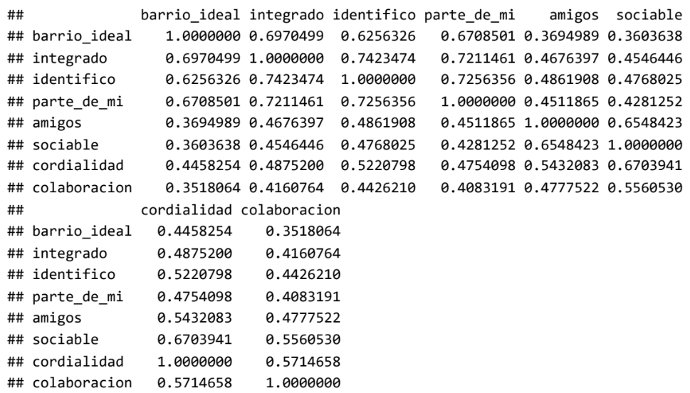

```{r, eval=FALSE}
tab_df(as.data.frame(R), title ="Matriz de Correlaciones")
```
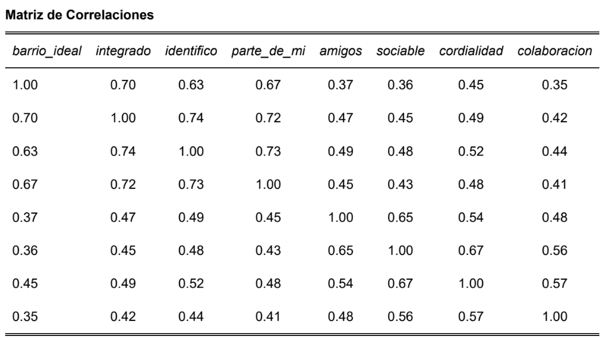

### Tabla: Matriz de correlaciones entre las 8 variables de cohesión territorial

## Interpretación de la matriz de correlaciones:

Valores de correlación cercanos a 1 = existe correlación, valores cercanos a 0 = no existe correlación.

- barrio_ideal con integrado	0.70	Quienes consideran su barrio ideal, tienden a sentirse integrados.
- identifico con integrado	0.74	Quienes se identifican con su barrio, tienden a sentirse integrados.
- sociable con cordialidad	0.67	Quienes perciben gente sociable, también la perciben cordial.
- amigos con sociable	0.65	Quienes hacen amigos fácilmente, perciben gente sociable.

## Observaciones clave:

Hay dos bloques de variables con altas correlaciones intra-bloque:

- Bloque 1 (identidad): barrio_ideal, integrado, identifico, parte_de_mi

- Bloque 2 (sociabilidad): amigos, sociable, cordialidad, colaboracion

**Esto sugiere que el EFA podría identificar dos factores latentes**

# ✅ 5. Pruebas de Adecuación

¿Qué hacemos? Evaluamos si los datos son adecuados para AFE mediante dos pruebas.

¿Por qué? No todas las matrices de correlaciones son aptas para factorización.

## 5.1 KMO (Kaiser-Meyer-Olkin)
Mide si las correlaciones parciales entre variables son pequeñas. Varía entre 0 y 1:

- > 0.9: Excelente

- > 0.8: Bueno

- > 0.7: Aceptable

- < 0.5: Inaceptable

# Calcular KMO
```{r, eval=FALSE}
corMat <- proc_data %>% 
  select(barrio_ideal:colaboracion) %>% 
  cor(use = "complete.obs")

KMO(corMat)
```

Resultado esperado:

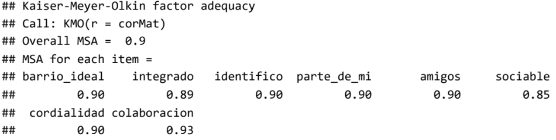

## Interpretación:

- Overall MSA = 0.9 → adecuación excelente para AFE

- Ninguna variable individual tiene MSA < 0.5 → todas las variables pueden mantenerse

## 5.2 Prueba de esfericidad de Bartlett
Evalúa si la matriz de correlaciones es una matriz identidad. Buscamos p < 0.05 para rechazar H0.

```{r, eval=FALSE}
# Prueba de Bartlett
cortest.bartlett(corMat, n =
3417
)
```

Resultado esperado:

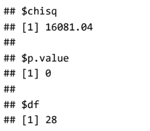

Interpretación: p = 0 < 0.05 → rechazamos H0. Las variables están correlacionadas y la matriz es apta para AFE.

# 📈 6. Determinación del Número de Factores
¿Qué hacemos? Utilizamos dos métodos para decidir cuántos factores retener.

## 6.1 Scree plot (gráfico de sedimentación)
```{r, eval=FALSE}
# Scree plot
scree(proc_data %>% select(barrio_ideal:colaboracion))
```
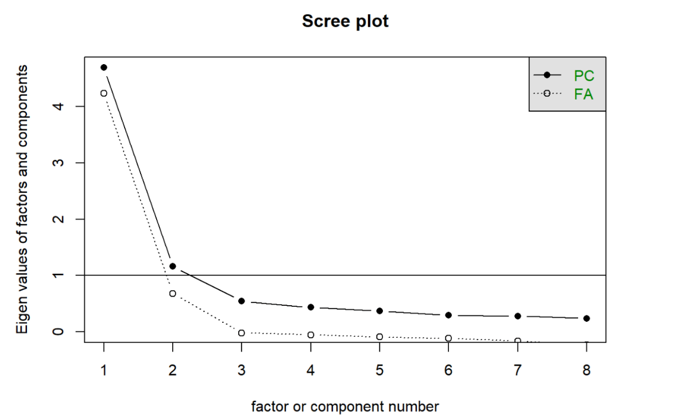

### Figura 1: Scree plot mostrando la caída de autovalores

**Interpretación:** El gráfico muestra una caída pronunciada después del segundo factor. También se observa un punto de inflexión en el tercer factor, pero la caída más clara es en el segundo.

## 6.2 Análisis paralelo de Horn (método más robusto)
```{r, eval=FALSE}
# Análisis paralelo
fa.parallel(corMat, n.obs = nrow(proc_data))
```
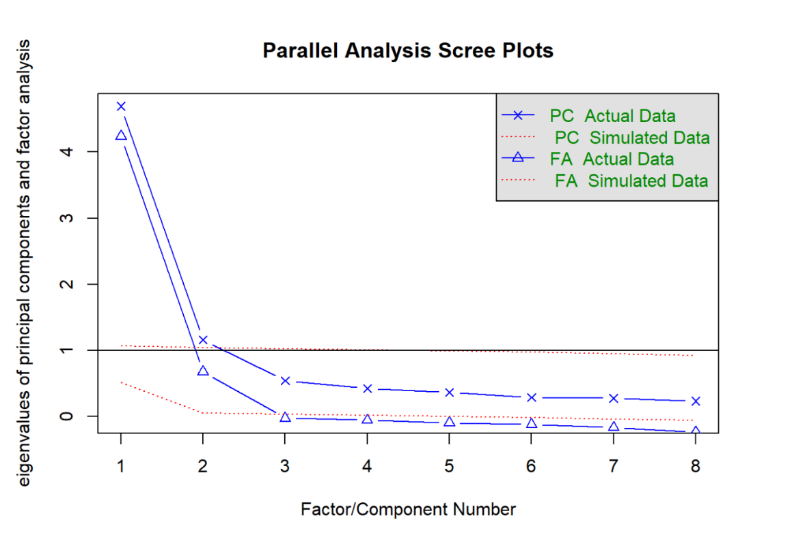

*Figura 2: Análisis paralelo de Horn - Comparación de autovalores observados vs. aleatorios*

Resultado esperado:
```{r, eval=FALSE}
## Parallel analysis suggests that the number of factors = 2 and the number of components = 2
```
**Interpretación:** El análisis paralelo (más robusto que el scree plot) sugiere retener 2 factores. Nos quedamos con este resultado por ser más confiable.

# 🔧 7. Extracción de Factores
¿Qué hacemos? Extraemos los factores usando dos métodos diferentes para comparar.

## 7.1 Método de Ejes Principales (Principal Axis - PA)
```{r, eval=FALSE}
# Extracción con ejes principales
fac_pa <- proc_data %>% 
  select(barrio_ideal:colaboracion) %>% 
  fa(nfactors = 2, fm = "pa")

print(fac_pa, digits = 2)
```

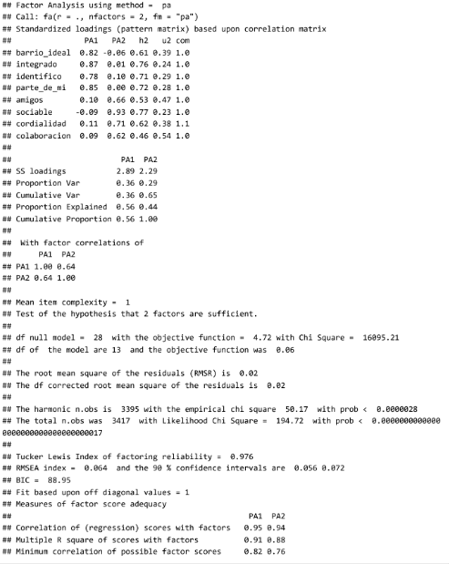

## 7.2 Método de Máxima Verosimilitud (Maximum Likelihood - ML)
```{r, eval=FALSE}
# Extracción con máxima verosimilitud
fac_ml <- proc_data %>% 
  select(barrio_ideal:colaboracion) %>% 
  fa(nfactors = 2, fm = "ml")

print(fac_ml, digits = 2)
```

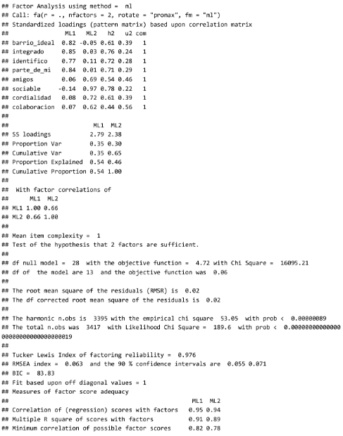

Interpretación de los resultados:

**Interpretación:**

- **Factor PA1** correlaciona alto con barrio_ideal, integrado, identifico y parte_de_mi

- **Factor PA2** correlaciona alto con amigos, sociales, cordialidad y colaboración.

La matriz de correlación entre los factores muestra una correlación de 0,64 que es alta, por lo que se sugiere una
rotación oblicua. Esto también es de suponer porque las variables originales miden cosas cercanas entre sí (en la
teoría)

# 🔄 8. Rotación de Factores
¿Qué hacemos? Aplicamos rotación Promax (oblicua) para obtener una estructura más clara.

¿Por qué? La correlación entre factores es alta (0.64), por lo que asumimos que los factores están relacionados.

```{r, eval=FALSE}
# Rotación Promax (oblicua)
fac_ml_pro <- proc_data %>% 
  select(barrio_ideal:colaboracion) %>% 
  fa(nfactors = 2, fm = "ml", rotate = "promax")

print(fac_ml_pro, digits = 2)
```

Tabla resumen con sjPlot:

```{r, eval=FALSE}
proc_data %>% 
  select(barrio_ideal:colaboracion) %>% 
  sjPlot::tab_fa(method = "ml", rotation = "promax", 
                 show.comm = TRUE, 
                 title = "Análisis factorial de cohesión territorial")
```

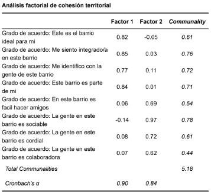

**Interpretación:**

### Factor 1: PERTENENCIA (α = 0.90)

- Agrupa variables de identidad y apego al barrio

- Explica el 40% de la varianza total

### Factor 2: SOCIABILIDAD (α = 0.84)

- Agrupa variables de relaciones sociales con vecinos

- Explica el 24% de la varianza total

- Varianza total explicada: 64% por los dos factores

# 📊 9. Cargas Factoriales

Al usar este otro código, necesitamos calcular aparte las cargas factoriales:

```{r, eval=FALSE}
fac_ml <- proc_data %>% select(barrio_ideal:colaboracion) %>% fa(nfactors = 2, fm= "ml", rotate = "promax", scores = "regression")
fac_ml
```

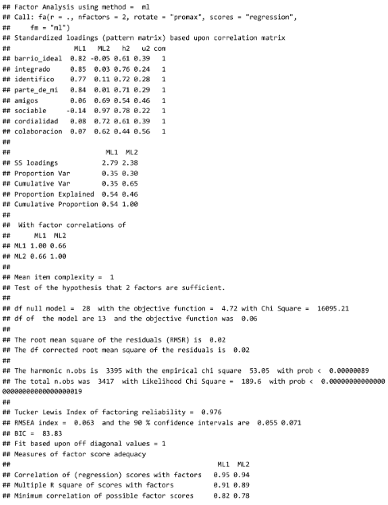

## 9.1 Renombramos los factores para darle más sentido a la interpretación

```{r, eval=FALSE}
colnames(fac_ml$loadings) <- c("pertenencia","sociabilidad")
colnames(fac_ml$scores) <- c("pertenencia","sociabilidad")
```

## 9.2 Combinar con los datos originales

```{r, eval=FALSE}
proc_data_scores <- cbind(proc_data, fac_ml$scores)
```

## 9.3 Vemos los valores para los primeros 10 casos:

```{r, eval=FALSE}
head(proc_data_scores[, c("pertenencia","sociabilidad")], 10
```
Salidad Esperada:

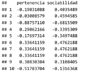

# 10. Mapa de Cargas
¿Qué hacemos? Visualizamos las cargas factoriales en un mapa de coordenadas.

¿Por qué? Para entender mejor la relación entre variables y factores.

```{r, eval=FALSE}
# Extraer cargas factoriales
loadings_df <- as.data.frame(unclass(fac_ml_pro$loadings))
colnames(loadings_df) <- c("pertenencia", "sociabilidad")
loadings_df$variable <- rownames(loadings_df)

# Gráfico de cargas factoriales
ggplot(loadings_df, aes(x = pertenencia, y = sociabilidad, label = variable)) +
  geom_point(color = "steelblue", size = 4) +
  geom_text_repel(size = 5, fontface = "bold") +
  geom_vline(xintercept = 0, linetype = "dashed", color = "gray50") +
  geom_hline(yintercept = 0, linetype = "dashed", color = "gray50") +
  theme_minimal(base_size = 14) +
  labs(
    title = "Mapa de cargas factoriales",
    subtitle = "Rotación Promax - Método ML",
    x = "Factor 1: Pertenencia",
    y = "Factor 2: Sociabilidad"
  )
```

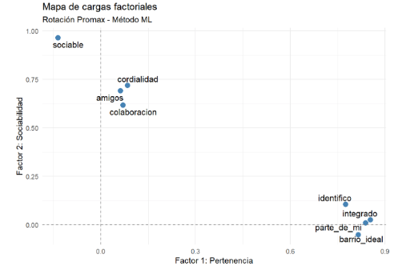

**Interpretación:** el gráfico da cuenta de cómo en este modelo las dos variables latentes, “pertenencia” y
“sociabilidad” permiten explicar el conjunto de los datos (al estar altamente correlacionadas con dos grupos de
variables)

En adelante, se pueden usar estas dos nuevas variables (con los puntajes factoriales para cada caso),
reemplazando las 8 variables originales

Estas dos variables también se puede considerar como dos dimensiones o indicadores o índices de cohesión
barrial.

# ⚠️ Notas Metodológicas Importantes
1. Tratamiento de escalas Likert
Las variables se trataron como numéricas asumiendo equidistancia entre categorías

Esto es aceptable en ciencias sociales para escalas de 5 puntos

2. Tamaño muestral
n = 3,417 casos → excelente para EFA (más de 10 casos por variable)

3. Valores perdidos
Se eliminaron códigos -999, -888, -777, -666 antes del análisis

Los casos con NA se excluyeron automáticamente en las funciones de psych

4. Elección del método de extracción
Se utilizó Máxima Verosimilitud (ML) por su eficiencia y propiedades estadísticas

Se comparó con Ejes Principales (PA) obteniendo resultados consistentes

5. Elección de rotación
Se usó Promax (oblicua) porque la correlación entre factores es alta (0.64)

Esto es más realista que asumir factores independientes

6. Confiabilidad
Alfa de Cronbach > 0.8 para ambos factores → excelente consistencia interna
