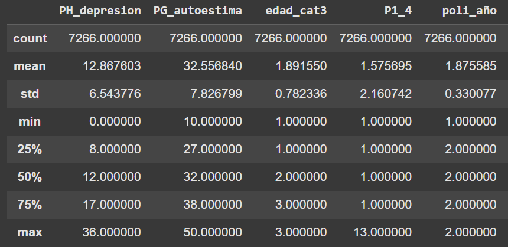

# 🎯 Objetivos del Análisis
Este ejercicio tiene como objetivos:

- Realizar un Análisis de Componentes Principales (PCA) con el paquete FactoMineR utilizando variables de cohesión territorial de la encuesta ELSOC.

- **Interpretar** los resultados del PCA: autovalores, cargas factoriales, varianza explicada.

- **Seleccionar** el número óptimo de componentes mediante diferentes criterios (autovalores > 1, gráfico de codo, prueba de Horn).

- **Construir** un índice de cohesión barrial a partir de la primera componente principal.

- **Visualizar** las relaciones entre variables y la distribución de casos.

# 📚 Fundamentos Teóricos
**¿Qué es el Análisis de Componentes Principales (PCA)?**
El Análisis de Componentes Principales es una técnica de reducción de dimensionalidad que:

Transforma un conjunto de variables correlacionadas en un nuevo conjunto de variables no correlacionadas llamadas componentes principales.

La primera componente principal captura la máxima varianza posible de los datos.

Las componentes siguientes capturan la varianza restante en orden decreciente.

# Aplicación en este ejercicio:

Construiremos un índice de cohesión barrial a partir de la primera componente principal, que resume 8 variables de percepción del barrio.

Variables utilizadas (escala Likert 1-4)
Variable original	Nombre en el script	Descripción
t02_01	barrio_ideal	Este es el barrio ideal para mí
t02_02	integrado	Me siento integrado/a en este barrio
t02_03	identifico	Me identifico con la gente de este barrio
t02_04	parte_de_mi	Este barrio es parte de mí
t03_01	amigos	En este barrio es fácil hacer amigos
t03_02	sociable	La gente en este barrio es sociable
t03_03	cordialidad	La gente en este barrio es cordial
t03_04	colaboracion	La gente en este barrio es colaboradora

# 📦 1. Instalación y Carga de Paquetes
¿Qué hacemos? Cargamos todas las librerías necesarias para el análisis.

¿Por qué? Necesitamos FactoMineR para el PCA, factoextra para visualizaciones, y paran para la prueba de Horn.

```{r, eval=FALSE}
# Instalar paquetes (solo primera vez)
install.packages(c("tidyverse", "sjPlot", "psych", "DescTools", 
                   "ggplot2", "broom", "rempsyc", "FactoMineR", 
                   "factoextra", "corrplot", "nFactors", "paran", 
                   "ggrepel", "knitr"))

# Cargar paquetes
pacman::p_load(
  tidyverse,      # Manipulación de datos
  sjPlot,         # Tablas
  psych,          # Correlaciones
  DescTools,      # Tablas
  ggplot2,        # Gráficos
  broom,          # Resultados ordenados
  rempsyc,        # Reportes
  FactoMineR,     # Análisis de componentes principales
  factoextra,     # Visualización de análisis factorial
  corrplot,       # Gráfico de correlaciones
  dplyr,          # Manipulación de datos
  nFactors,       # Número de factores
  ggplot,         # Gráficos
  paran,          # Prueba de Horn
  ggrepel,        # Etiquetas en gráficos
  knitr           # Tablas en R Markdown
)

# Limpiar R: desactivar notación científica
options(scipen = 999)
```

# 📂 2. Carga de la Base de Datos
¿Qué hacemos? Cargamos la encuesta ELSOC directamente desde Harvard Dataverse.

¿Por qué? La base está disponible públicamente y contiene las variables que necesitamos.

```{r, eval=FALSE}
# Cargar la encuesta ELSOC (ola 4, 2019)
load(url("https://dataverse.harvard.edu/api/access/datafile/7245118"))

# Ver dimensión de la base
dim(elsoc_long_2016_2022.2)
```

**Interpretación:** La base contiene 18,035 casos (entrevistados) medidos en 750 variables a lo largo de diferentes olas.

# 🔍 3. Selección de Variables
¿Qué hacemos? Seleccionamos 8 variables ordinales de escala Likert (1 a 4) del módulo de cohesión territorial.

¿Por qué? Estas variables miden diferentes dimensiones de la percepción del barrio y son adecuadas para PCA por estar en la misma escala.

```{r, eval=FALSE}
# Filtrar ola 4 y seleccionar variables
proc_data <- elsoc_long_2016_2022.2 %>%
  dplyr::filter(ola == "4") %>%
  dplyr::select(
    barrio_ideal = t02_01, # Este es el barrio ideal para mí
    integrado = t02_02,     # Me siento integrado/a en este barrio
    identifico = t02_03,    # Me identifico con la gente de este barrio
    parte_de_mi = t02_04,   # Este barrio es parte de mí
    amigos = t03_01,        # En este barrio es fácil hacer amigos
    sociable = t03_02,      # La gente en este barrio es sociable
    cordialidad = t03_03,   # La gente en este barrio es cordial
    colaboracion = t03_04   # La gente en este barrio es colaboradora
  )

# Definir valores perdidos (códigos comunes en ELSOC)
proc_data <- proc_data %>%
  sjlabelled::set_na(., na = c(-999, -888, -777, -666))

# Convertir las variables a numéricas (eran ordinales)
proc_data <- proc_data %>%
  mutate(across(everything(), ~ as.numeric(as.character(.))))

# Ver estructura
glimpse(proc_data)
summary(proc_data)
```

# 📊 4. Matriz de Correlaciones
¿Qué hacemos? Calculamos la matriz de correlaciones entre las 8 variables.

¿Por qué? El PCA se basa en las correlaciones entre variables. Altas correlaciones indican que las variables comparten información y pueden resumirse en componentes.

```{r, eval=FALSE}
# Calcular matriz de correlación (excluyendo NA)
matriz_cor <- cor(na.omit(proc_data))
print(matriz_cor)
```

## Salida esperada:



**Interpretación:**

- Las correlaciones son positivas y moderadas a altas (entre 0.35 y 0.74)

**Hay dos bloques de variables:**

- Bloque 1 (barrio_ideal, integrado, identifico, parte_de_mi): correlaciones muy altas entre sí (0.62-0.74)

- Bloque 2 (amigos, sociable, cordialidad, colaboracion): correlaciones altas entre sí (0.48-0.67)

**Esto sugiere que podrían existir dos dimensiones subyacentes**

# 📐 5. Realizar el Análisis de Componentes Principales (PCA)
¿Qué hacemos? Aplicamos PCA con el paquete FactoMineR.

¿Por qué? FactoMineR proporciona una salida completa y bien estructurada para interpretar.

```{r, eval=FALSE}
# Realizar PCA (con datos sin NA)
fit <- PCA(na.omit(proc_data), scale.unit = TRUE, graph = FALSE)

# Ver autovalores (eigenvalues)
fit$eig
```
**Salida esperada:**

text
##        eigenvalue percentage of variance cumulative percentage of variance
## comp 1   4.6776837                58.47105                            58.47105
## comp 2   1.1653557                14.56695                            73.03799
## comp 3   0.5470319                 6.83790                            79.87589
## comp 4   0.4340711                 5.42589                            85.30178
## comp 5   0.3687271                 4.60909                            89.91087
## comp 6   0.2928437                 3.66055                            93.57142
## comp 7   0.2798620                 3.49828                            97.06969
## comp 8   0.2344246                 2.93031                           100.00000

# 📈 6. Interpretación de Resultados
## 6.1 Cargas factoriales (coordenadas)
¿Qué hacemos? Examinamos las cargas factoriales (correlaciones variables-componentes).

¿Por qué? Nos indican qué variables definen cada componente.

```{r, eval=FALSE}
# Cargas factoriales (coordenadas)
```{r, eval=FALSE}
fit$var$coord
```
<div class="image-container" style="text-align: center; margin: 30px 0;">  <p style="color: #666; font-size: 0.9em; margin-top: 10px;"> <strong>Tabla 1:</strong> Coordenadas (cargas factoriales) de las variables en cada componente </p> </div>

**Interpretación de la tabla:**

La tabla fit$var$coord muestra las cargas factoriales, es decir, la correlación entre las variables originales y los componentes principales.

**Dimensión 1 (58.5% de varianza):**

- Todas las cargas son positivas y altas (entre 0.67 y 0.83)

- Esto indica que la primera componente mide un factor general de cohesión barrial

- Las variables con mayor carga son: integrado (0.83), identifico (0.83), parte_de_mi (0.81)

**Dimensión 2 (14.6% de varianza):**

- Cargas negativas para las variables de identificación directa con el barrio (barrio_ideal, integrado, identifico, parte_de_mi)

- Cargas positivas para las variables de relación con personas (amigos, sociable, cordialidad, colaboracion)

Esta dimensión distingue entre dos tipos de vinculación con el barrio:

- Vinculación directa (con el lugar): puntajes negativos

- Vinculación social (con las personas): puntajes positivos

## 6.2 Varianza explicada

```{r, eval=FALSE}
# Varianza explicada por componente
fviz_eig(fit, addlabels = TRUE, ylim = c(0, 60)) +
  theme_minimal() +
  labs(title = "Varianza explicada por componente",
       x = "Componente", y = "Porcentaje de varianza explicada")
```

<div class="image-container" style="text-align: center; margin: 30px 0;">  <p style="color: #666; font-size: 0.9em; margin-top: 10px;"> <strong>Figura 1:</strong> Gráfico de sedimentación (scree plot) mostrando la varianza explicada por cada componente </p> </div>

**Interpretación:**

- La primera componente explica 58.5% de la varianza total

- La segunda componente explica 14.6%

- Entre ambas explican 73% de la varianza

- A partir de la tercera componente, la contribución es marginal (<7% cada una)

# 🔍 7. Visualización de Variables en el Espacio de las Componentes
¿Qué hacemos? Graficamos las variables en el plano de las dos primeras componentes.

¿Por qué? Para visualizar las relaciones entre variables y las dimensiones subyacentes.

```{r, eval=FALSE}
# Preparar datos para gráfico
datos.grafico2 <- data.frame(fit$var$coord[, 1:2])

# Gráfico de variables
ggplot(datos.grafico2) +
  geom_point(aes(x = Dim.1, y = Dim.2), colour = "darkred", size = 3) +
  geom_text_repel(aes(x = Dim.1, y = Dim.2, label = rownames(datos.grafico2)),
                  size = 4, fontface = "bold") +
  geom_vline(xintercept = 0, colour = "darkgray", linetype = "dashed") +
  geom_hline(yintercept = 0, colour = "darkgray", linetype = "dashed") +
  labs(x = "Dimensión 1 (58.5%)", 
       y = "Dimensión 2 (14.6%)",
       title = "Círculo de correlaciones - Variables de cohesión barrial") +
  theme_minimal() +
  theme(legend.position = "none")
```

<div class="image-container" style="text-align: center; margin: 30px 0;">  <p style="color: #666; font-size: 0.9em; margin-top: 10px;"> <strong>Figura 2:</strong> Círculo de correlaciones - Posición de las variables en el plano de las dos primeras componentes </p> </div>
Interpretación del gráfico:

**Este gráfico confirma lo observado en las tablas:**

- Eje horizontal (Dimensión 1): Todas las variables tienen coordenadas positivas, indicando que miden un factor común de cohesión barrial. Las variables más a la derecha (integrado, identifico, parte_de_mi) son las que más contribuyen a esta dimensión.

- Eje vertical (Dimensión 2): Separa claramente dos grupos:

- Grupo A (abajo): barrio_ideal, integrado, identifico, parte_de_mi - variables que miden identificación directa con el barrio (como lugar)

- Grupo B (arriba): amigos, sociable, cordialidad, colaboracion - variables que miden relaciones sociales en el barrio

**Conclusión:** Existen dos dimensiones en la percepción del barrio: una de apego al lugar y otra de vínculos comunitarios.

# 👥 8. Visualización de Individuos
¿Qué hacemos? Graficamos la posición de los individuos (encuestados) en el mismo espacio.

¿Por qué? Para ver cómo se distribuyen las personas según sus puntuaciones en las componentes.

```{r, eval=FALSE}
# Preparar coordenadas de individuos
datos_grafico_ind <- data.frame(fit$ind$coord[, 1:2])
colnames(datos_grafico_ind) <- c("Dim.1", "Dim.2")

# Gráfico de individuos
ggplot(datos_grafico_ind) +
  geom_point(aes(x = Dim.1, y = Dim.2), colour = "darkred", alpha = 0.3, size = 0.8) +
  geom_vline(xintercept = 0, colour = "darkgray", linetype = "dashed") +
  geom_hline(yintercept = 0, colour = "darkgray", linetype = "dashed") +
  labs(x = "Dimensión 1 (58.5%)", 
       y = "Dimensión 2 (14.6%)",
       title = "Distribución de individuos en el espacio de las componentes") +
  theme_minimal()
```

<div class="image-container" style="text-align: center; margin: 30px 0;">  <p style="color: #666; font-size: 0.9em; margin-top: 10px;"> <strong>Figura 3:</strong> Distribución de los individuos en el plano de las dos primeras componentes </p> </div>

**Interpretación:**

- Cada punto es una persona encuestada.

- La nube de puntos se extiende principalmente a lo largo del eje horizontal (Dimensión 1)

- Hay personas con alta cohesión (derecha) y baja cohesión (izquierda)

- La Dimensión 2 separa a quienes se identifican más con el lugar (abajo) vs. con las personas (arriba)

# 🔄 9. Biplot (Variables e Individuos Juntos)
¿Qué hacemos? Creamos un biplot que muestra simultáneamente variables e individuos.

¿Por qué? Para visualizar la relación entre las características (variables) y los casos (personas).

```{r, eval=FALSE}

# Usamos prcomp para el biplot (compatible con ggbiplot)
proc_data_pca <- na.omit(proc_data)
fit_prcomp <- prcomp(proc_data_pca, scale. = TRUE)

# Biplot
library(ggbiplot)  # Si no está instalado: install.packages("ggbiplot")

ggbiplot(fit_prcomp, 
         obs.scale = 1, 
         var.scale = 1,
         alpha = 0.3) +
  scale_color_discrete(name = '') +
  expand_limits(x = c(-8, 4), y = c(-2.5, 2.5)) +
  labs(x = "Dimensión 1 (40.01%)", 
       y = "Dimensión 2 (23.46%)",
       title = "Biplot - Individuos y variables de cohesión barrial") +
  theme_minimal()
```

<div class="image-container" style="text-align: center; margin: 30px 0;">  <p style="color: #666; font-size: 0.9em; margin-top: 10px;"> <strong>Figura 4:</strong> Biplot mostrando individuos (puntos) y variables (flechas) </p> </div>

**Interpretación del biplot:**

- Las flechas representan las variables: su dirección indica cómo contribuyen a las componentes

- Los puntos son individuos: su posición indica sus puntuaciones en las componentes

- Individuos cercanos a una flecha tienen altos valores en esa variable

- La longitud de las flechas indica la calidad de representación de la variable

# 📊 10. Selección del Número de Componentes
## 10.1 Método de autovalores > 1
¿Qué hacemos? Seleccionamos componentes con autovalor (eigenvalue) mayor a 1.

¿Por qué? Es un criterio clásico (regla de Kaiser): componentes con autovalor > 1 explican más varianza que una variable original.

```{r, eval=FALSE}
# Autovalores
fit$eig
```
**Resultado:**

- Componente 1: 4.68 > 1

- Componente 2: 1.17 > 1

- Componente 3: 0.55 < 1

**Conclusión: Este criterio sugiere retener 2 componentes.**

## 10.2 Método del codo (scree plot)
¿Qué hacemos? Observamos el gráfico de sedimentación para identificar el punto de quiebre.

```{r, eval=FALSE}
fviz_eig(fit, geom = "line") + 
  theme_grey() +
  labs(title = "Scree plot - Método del codo")
```

<div class="image-container" style="text-align: center; margin: 30px 0;">  <p style="color: #666; font-size: 0.9em; margin-top: 10px;"> <strong>Figura 5:</strong> Scree plot para identificar el "codo" o punto de inflexión </p> </div>

**Interpretación:** El gráfico muestra una caída pronunciada hasta la componente 2, luego se estabiliza. Esto sugiere retener 2 componentes.

## 10.3 Prueba de Horn (Parallel Analysis) - MÉTODO MÁS PRECISO
¿Qué hacemos? Usamos la función paran para realizar el análisis paralelo de Horn.

¿Por qué? Este método compara los autovalores observados con los que se obtendrían por azar en datos aleatorios con la misma estructura. Es más robusto que los métodos anteriores.

```{r, eval=FALSE}
library(paran)

# Realizar análisis paralelo (excluimos primera columna si es necesario)
paran(na.omit(proc_data), iterations = 5000, graph = TRUE, color = FALSE)
```

<div class="image-container" style="text-align: center; margin: 30px 0;">  <p style="color: #666; font-size: 0.9em; margin-top: 10px;"> <strong>Figura 6:</strong> Análisis paralelo de Horn - Comparación de autovalores observados vs. aleatorios </p> </div>

**Salida esperada:**

## Results of Horn's Parallel Analysis for component retention
## 5000 iterations, using the mean estimate
## 
## Component   Adjusted   Unadjusted   Estimated
##            Eigenvalue  Eigenvalue    Bias
## 1           4.137924    4.202646    0.064722

**Interpretación de la prueba de Horn:**

La prueba indica que solo la primera componente tiene un autovalor ajustado superior a 1 (4.14). Esto significa que, aunque la segunda componente tiene autovalor > 1 en el análisis real, cuando se compara con lo que se obtendría por azar, su valor no supera el umbral.

Decisión final: Para construir un índice de cohesión barrial, utilizaremos UNA SOLA COMPONENTE (la primera), que ya explica el 58.5% de la varianza y captura el factor común de todas las variables.

# 🏗️ 11. Construcción del Índice de Cohesión Barrial
¿Qué hacemos? Construimos un índice como combinación lineal de las variables originales ponderadas por sus cargas factoriales.

¿Por qué? La primera componente principal es la mejor combinación lineal de las variables para resumir la información común.

## 11.1 Obtener los pesos (cargas factoriales)

```{r, eval=FALSE}
# Cargas factoriales de la primera componente
cargas_dim1 <- fit$var$coord[, 1]
print(round(cargas_dim1, 2))
```

**Resultado:**
barrio_ideal     integrado    identificor    parte_de_mi        amigos      sociable  cordialidad colaboracion 
        0.77          0.83          0.83          0.81          0.72          0.74          0.76          0.67 

## 11.2 Calcular el índice
¿Qué hacemos? Creamos una nueva variable que es la suma ponderada de las 8 variables originales.

```{r, eval=FALSE}
# Calcular índice de cohesión barrial
Indice_Cohesion_Barrial <- with(proc_data, 
                                 0.77 * barrio_ideal + 
                                 0.83 * integrado + 
                                 0.83 * identifico + 
                                 0.81 * parte_de_mi + 
                                 0.72 * amigos + 
                                 0.74 * sociable + 
                                 0.76 * cordialidad + 
                                 0.67 * colaboracion)

# Añadir a la base de datos
proc_data$Indice_Cohesion <- Indice_Cohesion_Barrial

# Ver resumen del índice
summary(proc_data$Indice_Cohesion)
```

## 11.3 Interpretación del índice

**Rango del índice:**

Valor mínimo teórico: Si una persona responde 1 (mínimo) en todas las variables:
1 * (0.77 + 0.83 + 0.83 + 0.81 + 0.72 + 0.74 + 0.76 + 0.67) = 1 * 6.13 = 6.13

Valor máximo teórico: Si una persona responde 4 (máximo) en todas las variables:
4 * 6.13 = 24.52

**Interpretación:**

- Valores más altos: Mayor cohesión barrial percibida

- Valores más bajos: Menor cohesión barrial percibida

- El índice combina tanto el apego al lugar como las relaciones sociales

# 📊 12. Visualización del Índice
¿Qué hacemos? Graficamos la distribución del índice creado.

```{r, eval=FALSE}
# Histograma del índice
ggplot(proc_data, aes(x = Indice_Cohesion)) +
  geom_histogram(bins = 30, fill = "steelblue", color = "white", alpha = 0.8) +
  labs(title = "Distribución del Índice de Cohesión Barrial",
       x = "Índice de Cohesión Barrial",
       y = "Frecuencia") +
  theme_minimal() +
  geom_vline(aes(xintercept = mean(Indice_Cohesion, na.rm = TRUE)),
             color = "red", linetype = "dashed", size = 1) +
  annotate("text", x = mean(proc_data$Indice_Cohesion, na.rm = TRUE) + 2,
           y = 200, label = "Media", color = "red")
```

<div class="image-container" style="text-align: center; margin: 30px 0;">  <p style="color: #666; font-size: 0.9em; margin-top: 10px;"> <strong>Figura 7:</strong> Distribución del Índice de Cohesión Barrial </p> </div>

# 📝 13. Interpretación Final y Aplicaciones
## 13.1 Resumen de hallazgos
Estructura factorial: Las 8 variables de cohesión barrial se resumen adecuadamente en una dimensión principal que explica el 58.5% de la varianza.

Dimensiones subyacentes: Aunque existe una segunda dimensión que distingue entre apego al lugar y vínculos sociales, su contribución es limitada (14.6%) y el análisis paralelo sugiere retener solo la primera componente.

Índice construido: El índice de cohesión barrial es una combinación ponderada que asigna mayor peso a:

integrado y identifico (0.83 cada una)

parte_de_mi (0.81)

barrio_ideal (0.77)

## 13.2 Aplicaciones del índice
El índice creado puede utilizarse como variable dependiente o independiente en análisis posteriores:

- Modelos de regresión: ¿Qué factores (género, edad, nivel educacional, tipo de barrio) predicen mayores niveles de cohesión barrial?

- Análisis de correspondencia: ¿Cómo se relaciona la cohesión barrial con otras variables categóricas?

- Comparaciones: ¿Existen diferencias significativas en cohesión barrial entre comunas, regiones o tipos de barrio?

## 13.3 Ejemplo de código para análisis posteriores

```{r, eval=FALSE}
# Ejemplo: ¿Diferencias por género? (requiere tener variable de género)
# proc_data$genero <- elsoc_long_2016_2022.2$m01[elsoc_long_2016_2022.2$ola == "4"]
# 
# # Boxplot por género
# ggplot(na.omit(proc_data), aes(x = genero, y = Indice_Cohesion, fill = genero)) +
#   geom_boxplot() +
#   labs(title = "Cohesión barrial por género",
#        y = "Índice de Cohesión Barrial") +
#   theme_minimal() +
#   theme(legend.position = "none")
```

# 💾 14. Exportar Resultados
¿Qué hacemos? Guardamos los resultados para su uso posterior.

```{r, eval=FALSE}
# Exportar base con índice
write_xlsx(
  list(
    DatosConIndice = proc_data,
    CargasFactoriales = as.data.frame(fit$var$coord),
    Autovalores = as.data.frame(fit$eig)
  ),
  "resultados_pca_cohesion_barrial.xlsx"
)

cat("✅ Resultados exportados a:", file.path(getwd(), "resultados_pca_cohesion_barrial.xlsx"))
```

# ⚠️ Notas Metodológicas Importantes

1. Escalamiento de variables
Se utilizó scale.unit = TRUE en PCA() para estandarizar las variables (media 0, desviación 1)

Esto es necesario porque aunque todas son escala Likert 1-4, el método PCA se basa en correlaciones

2. Tratamiento de valores perdidos
Se excluyeron casos con NA mediante na.omit() antes del PCA

Esto es necesario porque el PCA no admite valores perdidos

3. Selección del número de componentes
Se utilizaron tres criterios: autovalores > 1, scree plot, y análisis paralelo de Horn

El análisis paralelo es el más robusto y recomendado en la literatura

4. Construcción del índice
Se usaron las cargas factoriales crudas (no rotadas) porque solo retenemos una componente

El índice resultante es una variable continua apta para análisis paramétricos

5. Limitaciones
El índice asume que las variables Likert pueden tratarse como numéricas (equidistancia entre categorías)

La interpretación del índice depende de la calidad de las variables originales

